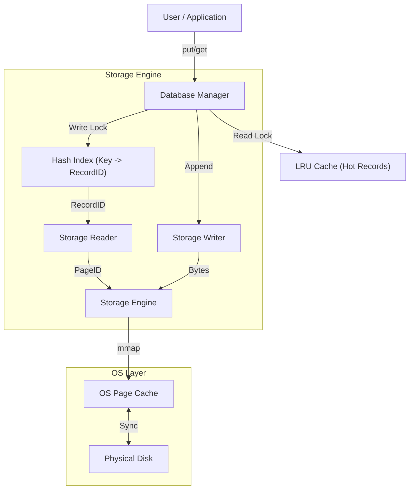

# Adaptive Query Accelerator (AQA)

[](https://github.com/abhikdps/adaptive-query-accelerator/actions/workflows/cmake.yml)


An Adaptive Query Accelerator in C++ that dynamically optimizes data access paths using learned caching and prefetching strategies.

AQA is currently a high-performance, **persistent Key-Value Store** built from scratch. It features a custom storage engine leveraging memory-mapped I/O (`mmap`), a slotted-page data layout, tiered caching (Page + Record), and thread-safe concurrency.

## Architecture

The system is designed with a strict hierarchy of ownership, separating the logical data view (Database) from the physical storage (Engine).



### Core Components

* **Database (The Orchestrator):** Manages the lifecycle of components and enforces concurrency rules using **Reader-Writer Locks** (`std::shared_mutex`). This allows for high-throughput parallel reads while ensuring atomic writes.
* **Indexing:** An in-memory **Hash Index** (`std::unordered_map`) maps keys to their physical disk location (PageID + SlotID), providing **O(1)** lookup complexity.
* **Tiered Caching:**
  * **L1 (Record Cache):** An LRU Cache stores deserialized "Hot" objects, bypassing the storage engine entirely for frequently accessed data (~110ns latency).
  * **L2 (Page Cache):** The OS Page Cache buffers 4KB disk blocks in RAM, minimizing physical I/O latency via zero-copy `mmap`.
* **Storage Engine:** Handles persistent storage. Reads are performed via pointer arithmetic (zero syscalls for cached pages), and writes use an append-only strategy for maximum throughput.
* **Slotted Pages:** Data is organized into 4KB pages with a slot directory, allowing for efficient record management, variable-length records, and internal fragmentation control.

## Performance Benchmarks

| Metric | Result | Analysis |
| :--- | :--- | :--- |
| **Write Throughput** | **1.62M ops/sec** | Append-only design saturates memory bandwidth; OS handles async disk flush. |
| **Scan Speed** | **10.4M recs/sec** | Zero-copy access via `mmap`. |
| **Cold Read Latency** | **1.48 µs** | Requires hashing, page lookup, and slot parsing. |
| **Warm Read Latency** | **0.11 µs** | **13.5x faster** than cold read. Hits L1 Record Cache, bypassing storage layer entirely. |

***Note:** Benchmarks run on Apple Macbook Pro M3 (1M Records, ~85MB Dataset)*

## Design Decisions

* **Why mmap?** Avoids double-buffering (copying data from Kernel space to User space), reducing CPU overhead for reads.
* **Why Slotted Pages?** Decouples record logic from physical offsets. This allows us to defragment or reorder records within a page without breaking external pointers (RecordIDs).
* **Why Reader-Writer Locks?** Database workloads are typically read-heavy (90/10 split). Blocking readers for every write would be inefficient; `std::shared_mutex` allows multiple concurrent readers.

## Build & Run

The project uses CMake and requires a **C++20** compliant compiler.

```bash
# Configure
cmake -B build -DCMAKE_BUILD_TYPE=Release

# Build
cmake --build build
```

### Running Benchmarks

To reproduce the performance numbers, run the storage benchmark suite:

```bash
# Runs the 1M record stress test (Write, Cold Read, Warm Read, Scan)
./build/benchmarks/storage_benchmark
```

## Testing

The codebase follows strict RAII (Resource Acquisition Is Initialization) principles.

* No raw new / delete.
* unique_ptr manages component lifecycles.
* Address Sanitizer (ASAN) compatible for memory safety verification.

To run the unit and integration test suite:

```bash
ctest --test-dir build/ --output-on-failure
```

### Test Coverage

* AccessObserverTest: Verifies the access observer ring buffer, hit/miss recording, and integration with PageCache and Database.
* PrefetchTest: Verifies prefetch_page bounds and scan with prefetch (record count).
* MappedFileTest: Verifies persistence and file growth.
* PageCacheTest: Verifies LRU eviction and cache hits/misses.
* PinningTest: Verifies that active pages are never evicted (Buffer Pool safety).
* IntegrationTest: Verifies the full stack from API to Disk.
* ReaderTest: Validates the slotted page parser and data integrity.
* RecoveryTest: Ensures data persistence and index reconstruction after a restart.
* ConcurrencyTest: Verifies thread safety under heavy read/write contention.
