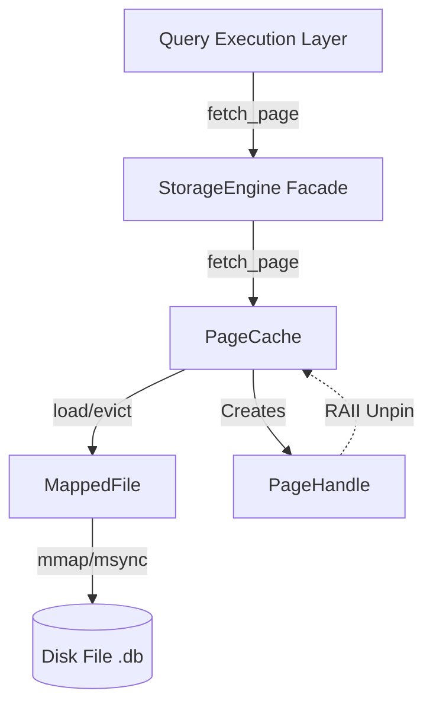

# Storage Engine Architecture

This document details the design and implementation of the AQA Storage Layer. The storage engine provides high-performance, buffered access to disk pages using memory-mapped I/O (`mmap`) and a custom Page Cache (buffer pool) with LRU eviction by default and optional pluggable policies (e.g. scan-resistant, LFU, hint-aware). See [eviction-policy.md](eviction-policy.md) and [access-observer.md](access-observer.md).

## 1. High-Level Architecture

The system follows a strict hierarchy of ownership to ensure memory safety and clear separation of concerns.

### Core Components

- **StorageEngine:** The public facade. It initializes the file and cache, and provides the primary API fetch_page(page_id).

- **MappedFile:** Manages the raw OS file descriptor and memory mapping. It provides a "zero-copy" view of the disk.

- **PageCache:** The "Buffer Pool." It maintains a fixed set of hot pages in RAM to minimize OS page faults and manage dirty writes.

- **PageHandle:** A smart-pointer-like object returned to the user. It represents a "lease" on a page.

## 2. Design Decisions

### Why `mmap`?

We chose memory-mapped I/O over standard `read()`/`write()` syscalls for several reasons:

- **Pointer Swizzling:** Once a page is faulted in by the OS, accessing it is as cheap as a standard pointer dereference (~10ns). Standard I/O requires a syscall (~1-2µs) and a copy from kernel space to user space.

- **OS-Managed Paging:** We leverage the OS's virtual memory subsystem to handle the complexity of reading blocks from physical media.

- **Simplified Code:** We don't need to manage complex read buffers or partial reads; the file looks like a large array of bytes.

### Memory Ownership & RAII

To prevent memory leaks and race conditions, we strictly enforce **Resource Acquisition Is Initialization (RAII)**:

- **No Raw Pointers:** Users never see a raw `Page*`. They only ever hold a `PageHandle`.

- **Strict Ownership:**

  - `MappedFile` owns the file descriptor and `mmap` region.

  - `PageCache` owns the `std::vector` of page frames (RAM).

  - `PageHandle` owns the pin count logic.

- **Deleted Copy:** Critical classes (`MappedFile`, `PageCache`) cannot be copied, only moved. This prevents "double-free" bugs where two objects try to close the same file descriptor.

## 3. Page Cache & Eviction

The `PageCache` uses **LRU (Least Recently Used)** replacement by default. When an optional **eviction policy** is provided (e.g. `ScanResistantPageEvictionPolicy`, `HintAwarePageEvictionPolicy`), it chooses the victim from the unpinned pages (still in LRU order) instead of always picking the oldest. An optional **access observer** can record page accesses so adaptive policies can prefer evicting scan traffic or keep frequently used pages.

### Data Structures

- **Frame Pool:** A `std::vector<RawPage>` that holds the actual page data in RAM.

- **Page Map:** An `unordered_map<PageID, FrameID>` for O(1) lookup.

- **LRU List:** A `std::list<PageID>` (doubly linked list).

  - **Front:** Most Recently Used (MRU).

  - **Back:** Least Recently Used (LRU).

### Workflow

1. **Hit:** If requested page is in the map:

    - Move page node to the front of the LRU list.

    - Increment pin count.

    - Return handle.

2. **Miss:** If page is not in map:

    - Check for free frames. If none, call `evict()`.

    - Load data from `MappedFile` into the frame.

    - Add to map and front of LRU list.

3. **Eviction:**

    - Build the list of unpinned page IDs in LRU order (back to front).

    - If an eviction policy is set, call `choose_victim(unpinned_lru)`; otherwise take the first (oldest).

    - Write the victim frame back to `MappedFile` (currently all evicted pages are written back; a dirty flag is not yet implemented).

    - Remove from metadata and reuse the frame.

## 4. Pinning Semantics

Pinning prevents the cache from evicting a page while it is actively being used by a C++ thread.

- **Pin:** Happens automatically when fetch_page() creates a PageHandle.

- **Unpin:** Happens automatically when the PageHandle goes out of scope (destructor is called).

- **Safety Rule:** If all pages in the cache are pinned (pin count > 0), the system throws a `std::runtime_error` ("Buffer Pool Full: All pages are pinned."). The application must release handles before requesting more pages.

## 5. Limitations & Future Work

1. **Thread Safety:** The current implementation uses a coarse-grained `std::mutex` on the entire cache. High concurrency workloads will contend on this lock. Future work involves Lock Striping or Latch Crabbing.

2. **Dirty Flags:** Currently, `evict()` writes back every evicted page. An `is_dirty` flag (or similar) would avoid writing read-only pages back to disk.

3. **Clock Replacement:** The `std::list` LRU overhead is high (pointer chasing). A "Clock" or "Second Chance" algorithm would be more cache-friendly.
