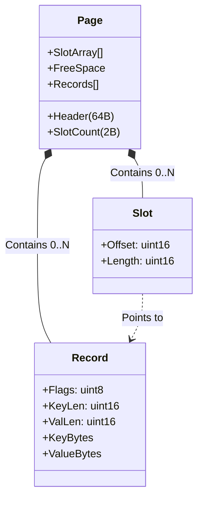

# Storage Format Specifications v2

**Architecture:** Slotted Page with variable-length records.

## 1. File Structure

The database file (`.db`) is a linear sequence of 4KB fixed-size pages.

```text
[Page 0] [Page 1] [Page 2] ... [Page N]
```

## 2. Page Layout (4KB)

Each page organizes data using a **Slotted Page** approach. The page grows from both ends towards the middle.

- **Header:** Fixed 64-byte `PageHeader` (magic, page_id, next/prev, tuple_count, free_space offsets, flags, padding). The slotted-page payload (slot count, slots, records) lives in the remaining bytes.
- **Slot count & Slots:** At the start of the payload (low addresses); grow upward.
- **Record Data:** Grows downward from the end of the page.
- **Free Space:** The gap in the middle. The page is full when these regions meet.

```text
+-------------------------------------------------+ 0
|   Page Header (64 Bytes)                        |
|   magic, page_id, next_page_id, prev_page_id,   |
|   tuple_count, free_space_start, free_space_end, |
|   flags, padding                                |
+-------------------------------------------------+ 64
|   Slot Count (2 Bytes)                          |
+-------------------------------------------------+ 66
|   Slot[0] {Offset, Len} (4 bytes)               |
|   Slot[1] {Offset, Len}                         |
|   ...                                           |
|   Slot[k]                                       |
+-------------------------------------------------+
|                                                 |
|                 FREE SPACE GAP                  |
|       (variable size, decreases on write)      |
|                                                 |
+-------------------------------------------------+
|   Record[k] Data                                |
|   ...                                           |
|   Record[0] Data                                |
+-------------------------------------------------+ 4096
```

## 3. Data Structures

### A. Record ID (RID)

A globally unique identifier for any record in the database.

- **Size:** 48 bits in practice (page_id 32 bits + slot_id 16 bits). Implemented as `struct RecordID { uint32_t page_id; uint16_t slot_id; }`.
- **Usage:** To find a record, fetch the page by `page_id`, then look up `Slot[slot_id]`.

### B. Slot Entry

Each entry in the Slot Array is a 4-byte descriptor.

- **Offset (16 bits):** Byte offset of the record start relative to the Page start.
- **Length (16 bits):** Total length of the record (Header + Key + Value).

### C. Record Format

The actual data stored in the payload heap. It supports variable-length keys and values.

| Field | Size | Type | Description |
| :--- | :--- | :--- | :--- |
| **Meta** | 1 Byte | `uint8_t` | Flags (see below). |
| **Key Len** | 2 Bytes | `uint16_t` | Length of the Key in bytes. |
| **Val Len** | 2 Bytes | `uint16_t` | Length of the Value in bytes. |
| **Key** | *Var* | `char[]` | The key data. |
| **Value** | *Var* | `char[]` | The value data. |

**Metadata Flags:**

- `0x01` (**TOMBSTONE**): The record is marked as deleted.
- `0x00` (Alive): Valid record.

## 4. Visual Diagram



## 5. Write Mechanics (Append-Only)

When inserting a new record:

1. **Check Capacity:** Ensure `FreeSpace >= sizeof(Slot) + sizeof(Record)`.
2. **Append Data:** Copy the `Record` bytes to the **end** of the Free Space (growing downwards).
3. **Add Slot:** Append a new `Slot` entry to the **start** of the Free Space (growing upwards).
4. **Update Count:** Increment `Slot Count`.

***Note:** For B+ tree pages, the slot array may be kept sorted by key for binary search within the page; the main KV storage uses an append-only slotted layout as described above.*
